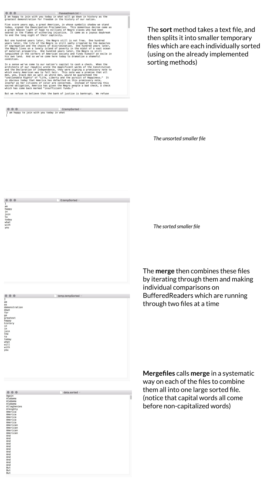

# OnDisk Sort

*This is an individual assignment.*

## Key Terms and Concepts

* File I/O - Methods for handling input (I) and output (O) to different files. Allows us to read and modify various files through different systems. (See **Appendix A - File I/O in Java**, and these two tutorials [[1](https://docs.oracle.com/javase/tutorial/essential/io/),[2](https://www.tutorialspoint.com/java/java_files_io.htm)] for more).

* Mergesort - A divide and conquer algorithm for sorting arrays of n elements in O(n log n) time. The data to be sorted are split into smaller chunks, sorted, and then merged back together by doing simple comparisons while iterating through the smaller sorted sets (See lecture slides and  2.2 pg. 270 - 277 in the recommended textbook for more).

* Iterator - An interface that allows traversal through a collection based on some property. Requires the `hasNext()` (which checks if there is another element left) and `next()` (which returns the next element) methods (See slides, pg. 100, various other examples in the recommended textbook, and [the Java documentation](https://docs.oracle.com/javase/8/docs/api/java/util/Iterator.html) for more)

## Learning Goals

* Practice reading from and writing to files.
* Practice using Java exceptions and try/catch statements.
* Practice using an Iterator to iterate over a collection of Strings.
* Implement a divide-and-conquer algorithm that uses a smart trick to tackle memory constraints.

## Description

For this assignment, you will be implementing an on-disk sorting algorithm that is designed to use the disk efficiently to sort massive amounts of data. All of the sorting algorithms we have seen so far assume that the data can fit in the main memory and that we can swap data elements efficiently.

Sometimes, because of the size of the data you cannot fit all of it in the memory (usually RAM). In these situations, many of the traditional sorting algorithms fail miserably; the algorithms do not preserve data locality and end up accessing the disk frequently, resulting in very slow running times. [External sorting](https://en.wikipedia.org/wiki/External_sorting) techniques allow us to use the external memory (usually hard disk drive) to overcome these constraints. In this assignment, you will implement an external on-disk mergesort.

Your on-disk mergesort algorithm will work in two phases:

1. Your sorting algorithm breaks the data into reasonably-sized chunks (chunks that can fit in the main memory) and sorts each of these individual chunks using mergesort. This is accomplished by reading a chunk of data, sorting it, writing it to a temporary file, then reading another chunk of data, etc. At the end of this phase, you will have a number of temporary files on disk that are all individually sorted.

2. You will need to merge all of these temporary files into one large file which will be your final output. This is accomplished by pair-wise merging of the files (very similar to the merge phase of mergesort) and then writing out the result to a new, larger merged file. Eventually, all of the files will be merged into one large file. Note, this can be done very memory efficiently.

**The autograder expects you to follow the naming conventions specified in this document.**

## Classes

The following classes are provided to you, and you do not need to modify them.

* `Sorter`: An interface for sorting algorithms. Implemented by the `MergeSort` class.
* `MergeSort`: An implementation of the Mergesort algorithm.
* `WordScanner`: Implements the Java `Iterator` interface. An iterator over `Strings` read in as words from an input. You will use the constructor, `next()`, `hasNext()`, and `close()` methods in the `sort` method of `OnDiskSort` to read each line of the original file you want to sort.

### `OnDiskSort`

We provided a skeleton `OnDiskSort` class that you will need to complete. **Start by reviewing the existing code and making note of the `TODO` comments**.

We encourage you to add additional private methods, but do not change the names or parameters of the provided methods. As an aside, we have made some of the methods protected where normally we would have made them private to, again, assist us in grading.

#### `OnDiskSort` constructor

The constructor takes three parameters:

* `maxSize` corresponds to the maximum size of data we can sort in memory.
* `workingDirectory` should be the `sorting_run` directory we provided.
* `sorter` should be an object of a class that implements the `Sorter<String>` interface (i.e., `MergeSort`).

#### `sort` method

This is the public method that will be called when you want to sort new data. For this assignment, we will only be sorting `String` data, specifically words in text files. Uppercase letters are before lowercase letters. This method will

1. read in the data, `maxSize` words at a time,
2. sort each chunk using the sorter,
3. store the sorted chunk in a temporary file, and
4. then put the file into an `ArrayList` of `File`s.

Once all of the data has been read in, you will have an `ArrayList` of `File`s, each of which is individually sorted. You should then call the `mergeFiles` method to merge all the sorted files.

You will need to create temporary files along the way (for example, to store the sorted chunks). This should be done in the `sorting_run` directory (which is also just a `File`). We suggest you name the temporary files something simple like `0.tempfile`, `1.tempfile`, etc.

Make sure you close the `WordScanner` stream and clear the working directory when you're done, using the `clearOutDirectory()` method. `sorter` is the sorter that you should use to sort each chunk. `outputFile` will contain the final result of your sorting.

#### `merge` method

The `merge` method takes two  `File`s that have already been individually sorted and merges them into one output sorted file. This is very similar to the `merge` method of `MergeSort`. The main difference is that rather than merging two sorted subarrays, you are merging two sorted files. You **should not simply read in the data from both of these files and then use the merge method from MergeSort**.

We are trying to be memory efficient and this would defeat the purpose of this exercise as we cannot fit in memory more data than each of the individual sorted file holds. Instead, you should open `BufferedReader`s to both of the files and then, reading one line at a time, read either from the first file or the second, and write that directly out to the output file, depending on which one is smaller (in the lexicographical sense). Besides the variables for doing the file I/0, you should only need **two** String variables to keep track of the data.

#### `mergeFiles` method

This method takes an `ArrayList` of `File`s, each of which should contain sorted data and then uses the `merge` method to eventually merge them into one large sorted file. Notice that the `merge` method only merges two files at a time. The easiest way to merge all of the `n` sorted files is to merge the first two files, then merge the third file with the result of merging the first two files, then the fourth, and so on. If you had 8 files, that would look like:

```text
        f0 f1 f2 f3 f4 f5 f6 f7
          V   /  /  /  /  /  /
          f0 /  /  /  /  /  /
           \/  /  /  /  /  /
           f0 /  /  /  /  /
            \/  /  /  /  /
            f0 /  /  /  /
             \/  /  /  /
             f0 /  /  /
              \/  /  /
              f0 /  /
               \/  /
               f0 /
                \/
                f0
```

This is *not* the most efficient way of doing it. However, it will make your life easy (see the extra credit for doing it a better way). NOTE: you should not read and write to a file at the same time, so you will need to use a single temporary file to store your temporary results as you merge the data. `copyFile` should come in handy! Each time you need to merge a new file, merge the new file with the temporary file and put the results in the `outputFile`. Then, copy the `outputFile` to the temporary file to get ready to merge the next file.

#### `main` method

Your `main` method gets everything going and is provided to you.

1. It creates a `sorter` that does a mergesort in memory, then creates a `diskSorter` to do the external merges. Parameters to the `OnDiskSort` sets up directory sorting run to be the working directory for the sorts.
2. It then creates a word scanner to read King's *"I have a dream"* speech.
3. Finally it calls the `sort` method of `diskSorter` with the scanner to input all the words of the speech, sorts them, and puts them in the file `data.sorted`.

To assist you, we have also provided a few helper methods in the `OnDiskSort` class that you may find useful; they primarily do some simple operations with files. If there is any confusion about what these methods do, please come talk to us. In addition, these helper methods may also help you understand basic Java file I/O. For more on file I/O, you can also see **Appendix A - File I/O in Java**



## Getting started

1. You will need a directory in which to put the files to be sorted. We suggest you use the provided `sorting_run` in your project directory. In that directory, we have put a file containing a copy of King's "I have a dream" speech. It is in a file named "Ihaveadream.txt". Be sure to name these exactly as given here, and make sure the directory `sorting_run` is in the same level as the `src` and `bin` directories. (If not, then the program won't find them and it will crash!) See the main method of `OnDiskSort` for the names. Note that we may test your code using a different directory for temporary files, so your code shouldn't use the name `sorting_run` except in its main method as a default value.

2. See **Appendix A - File I/O in Java** and **Appendix B - The file system** for some background on the project.

3. Start working on the methods in `OnDiskSort`. Try to understand how they each fit together before beginning work on them. The recommended order for the methods is the one presented in the **Classes** section, though you can jump around and work on various other pieces if you are stuck on one method.

4. In VS Code you might need to occasionally refresh contents the explorer.

5. Create a small test file and make sure that you create the appropriate number of temporary files in `sort` and that you correctly merge them into the final `data.sorted` file. **Submit that test file with your code on Gradescope.**

6. The final file will contain all strings starting with a capital letter first. This is to be expected according to `String`'s [`compareTo` method](https://docs.oracle.com/javase/10/docs/api/java/lang/String.html).


## Grading

You will be graded based on the following criteria:

| Criterion                                | Points |
| :--------------------------------------- | :----- |
| Autograder                               | 7      |
| `Merge`                                  | 3      |
| `MergeFiles`                             | 3      |
| `Sort`                                   | 3      |
| Uses only 2 strings in `merge`           | 2      |
| Cleans up temporary files appropriately  | 2      |
| Appropriate comments (including JavaDoc) | 1      |
| Has created own test file                | 1      |
| Style and Formatting                     | 1      |
| **Total**                                | **23** |
| Extra Credit                             | 2      |

NOTE: Code that does not compile will not be accepted! Make sure that your code compiles before submitting it.

## Submitting your work

Double-check that your work is indeed pushed in GitHub and appears on Gradescope! It is your responsibility to ensure that you do so before the deadline.

## Extra credit

As we mentioned above, this is not an efficient way to merge all of the sorted chunks. Once you have things working above, for extra credit, implement a more efficient `mergeFiles` method. Let's call this method `mergeFilesExtraCredit`. It should be merging pairs of files of the same size. That is, if you start with `n` files of size `k`, merge them in pairs to obtain `n/2` files of size `2*k`. Then merge those together in pairs to get `n/4` files of size `4*k`. Continue until they are all merged. This is optional and you do not have to do it! Similar to `mergeFiles`, create a single temporary file. Start with the first and second file, merge them into the temporary file and then use the `copyFile` method to move the contents of the temporary file over either the first or second file and keep track of the name. Merge the third and fourth and again copy the contents back to either the third or fourth filename and keep track of that. After one pass, you'll have half as many files. Repeat this process.

Here's how that would look if we had 8 files that have been individually sorted and we were to call `mergeFilesExtraCredit`:

```text
    f0 f1 f2 f3 f4 f5 f6 f7
      V     V     V     V
      f0   f2     f4   f6
       \  /        \   /
        f0          f4
         \          /
          \        /
           \      /
            \    /
              f0
```

Think of what happens when you `n` is not a power of 2.

## Appendix A - File I/O in Java

This is a brief refresher into File I/O in Java. You can also look
up information about the classes seen in the code and discussed here via the Java libraries link there. For most I/O, you'll need to `import java.io.*`.

To create a reference to a file you will use the class `File` whose constructor takes as a parameter a `String` that contains the path that the file will reside. Please note that instantiating an object of type `File` will not create an empty file. Instead, you will need to use a `PrintWriter` as described below.

A few useful things to keep in mind:
* If you have an object of type `File` you can get its location in memory through its `getAbsolutePath()` method.
* Depending on the operating system that you use, the separator in paths might take different forms, e.g., `/` or `\`. A useful shortcut to find it is to use the `File.separator` String.
* Putting these two things together, you can create a `String` that will be used in `File`'s constructor without hard-coding paths.

The two main classes you'll be concerned with when doing file I/O in java are `BufferedReader` for
reading data and `PrintWriter` for writing data. To read data, you can create a new reader by:

```java
BufferedReader in = new BufferedReader(new FileReader(...))
```

where `...` can be either replaced with a `String` or can be replaced with a `File` object.

To write data, you can create a new writer by:

```java
PrintWriter out = new PrintWriter(new FileOutputStream(...))
```

In both cases, you will need to surround these with a try-catch to handle the `IOException`.

### Appendix B - The file system

The file system on these computers starts at the very base directory of `/`. This directory is also called the root. Everything is then expanded out based on directories. For example `/home/yourusername/` is two directories starting from the base, first `home` then `yourusername`. The `/` is called the file separator and is different depending on the operating system (e.g. it's `\` on Windows computers). Filenames can be specified as *relative* filenames, where they are relative to the current location of the program (or user). Relative filenames do NOT start with a `/`. If you ever want to know where you are when you're in the `Terminal`, the `pwd` command (for *print working directory*). Rather than hard-coding in a file or directory, you can also pop up a dialog box and let the user choose the file. For this assignment, don't use absolute filepaths (only relative ones), as the TAs will download your work to grade it, and their computers have a different directory structure from yours.
